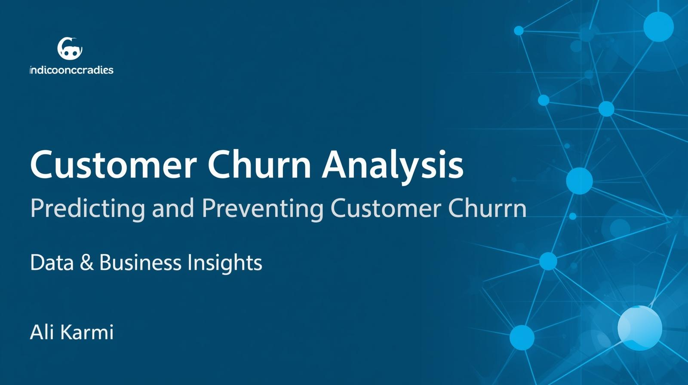

# 📊 Telco Customer Churn Prediction

### 🎯 Project Overview
This project aims to predict customer churn in a telecom company and extract business insights to help reduce churn.  
The dataset contains customer demographic information, subscription details, service usage, and churn labels.

---

## 🧩 Steps and Methodology

### 1️⃣ Exploratory Data Analysis (EDA)
- Created **histograms** for continuous variables and **bar plots** for categorical ones to explore distributions.  
- Detected potential outliers and missing values.  

### 2️⃣ Data Preprocessing
- Encoded categorical features using **binary encoding** and **dummy variables**.  
- Converted all variables to numeric type.  
- Managed outliers using the **IQR method**.  
- Filled missing values in the `TotalCharges` column with the **median**.  
- **Normalized** numerical features for consistent scaling.  
- Created a **correlation heatmap** and removed features with strong correlation (>|0.7|) — chose to drop the one with lower correlation to the target.  
  → `TotalCharges` and `MonthlyCharges` were removed.  

---

### 3️⃣ Modeling
- Split the dataset into **train** and **test** subsets.  
- Evaluated multiple classifiers — the best performers were **XGBoost** and **CatBoost**, both optimized using **Optuna** with 200 iterations and **cross-validation (CV)** for robust evaluation.  
- Adjusted probability threshold from **0.5 to 0.4** to improve **recall**, since in churn analysis recall is more important than overall accuracy.

---

### ⚙️ Performance Summary

| Model | Accuracy | Recall (class=1) | F1-score (class=1) |
|--------|-----------|------------------|---------------------|
| XGBoost (test) | 0.80 | 0.66 | 0.63 |
| CatBoost (test) | 0.80 | 0.66 | 0.64 |

📌 *Higher recall ensures more potential churners are identified — critical for retention campaigns.*

---

### 💡 Feature Importance

#### XGBoost — Top Features
| Feature | Importance |
|----------|-------------|
| Contract_Two year | 27.94 |
| tenure | 24.33 |
| InternetService_Fiber optic | 10.26 |
| InternetService_No | 9.37 |
| Contract_One year | 5.03 |
| PaymentMethod_Electronic check | 4.67 |
| PaperlessBilling | 1.95 |
| OnlineSecurity | 1.88 |

#### CatBoost — Top Features
| Feature | Importance |
|----------|-------------|
| Contract_Two year | 0.30 |
| InternetService_Fiber optic | 0.14 |
| Contract_One year | 0.09 |
| InternetService_No | 0.07 |
| tenure | 0.05 |
| PaymentMethod_Electronic check | 0.05 |
| OnlineSecurity | 0.03 |

---

## 🧠 Key Insights

1️⃣ **Contract Length Matters**  
   Customers with longer-term contracts (1 or 2 years) are far less likely to churn.  
   👉 Encouraging month-to-month users to switch to longer contracts can reduce churn rates.

2️⃣ **Internet Service Type is a Key Factor**  
   Customers using **fiber optic** internet have lower churn rates compared to others.  
   👉 Offering or upgrading to premium internet services can improve retention.

3️⃣ **Customer Tenure Correlates with Loyalty**  
   Tenure (time as a customer) strongly impacts churn — the longer they stay, the more loyal they become.  
   👉 Target newer customers with special offers to help them stay past the early churn window.

---

## 📈 Business Takeaway
This analysis not only predicts who is likely to churn (with ~80% accuracy)  
but also provides clear insights on **how to reduce churn** through actionable strategies in contract design, payment options, and service upgrades.

---

## 🧩 Tools & Libraries
`Python`, `Pandas`, `NumPy`, `Matplotlib`, `Seaborn`, `Scikit-learn`, `XGBoost`, `CatBoost`, `Optuna`

---

### 👤 Author
**Ali Karimi**  
MBA & Data Analyst — Bridging Data and Business  
🔗 [LinkedIn Profile](https://www.linkedin.com/in/ali-karimi-8474a3a3/)
